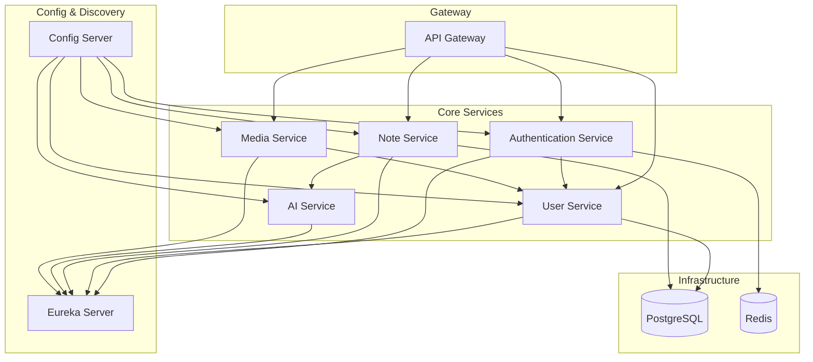

# Reflecta

Backend for Reflecta — an application that allows users to write reflective diary notes and receive AI-generated responses.

##  Microservice Overview

The system is composed of several microservices responsible for note management, user management, authentication, and media handling.

Services communicate via REST APIs using **FeignClient**.

---

### `config-server`

Centralized management of external configuration properties across all environments.

---

### `discovery-server`

Eureka Server where all services are registered, enabling dynamic service discovery and communication between services.

---

### `api-gateway`

Gateway service and single entry point for clients. It validates **Access JWTs** and forwards authenticated requests to internal services.

**Public (unauthenticated) endpoints:**
- `POST /api/auth/register`
- `POST /api/auth/login`
- `POST /api/auth/refresh`
- `GET /media/avatars/**`

---

### `user-service`

Handles user profile operations: creation, updates, deletion, password and username changes.

All endpoints require authentication. The main interaction point is `/api/me`.

**Endpoints:**
- `GET /api/me` — retrieve the current user's profile
- `PUT /api/me` — update user profile
- `DELETE /api/me` — delete profile (triggers logout across sessions via `authentication-service`)

---

### `authentication-service`

Handles all aspects of authentication:
- Issues **access** and **refresh** tokens
- Validates login and registration requests
- Supports **token rotation** for enhanced security

**Endpoints:**
- `POST /api/auth/register` — register a new user (calls `user-service`); returns `AuthResponse`
- `POST /api/auth/login` — authenticate user credentials; returns `AuthResponse`
- `POST /api/auth/refresh` — refresh access token using `refreshToken` + `sessionId` from Redis; returns `AuthResponse`
- `POST /api/auth/logout` — log out from current session
- `POST /api/auth/logout/all` — log out from all sessions

---

### `media-service`

Handles user avatar uploads.

**Endpoint:**
- `POST /api/me/avatar` — accepts a multipart file, stores it, and sends the resulting URI to `user-service`, updating the `User.avatar` field.

---

### `note-service`

Responsible for note CRUD and threaded conversations. Acts as a **middleware** between the user and the AI assistant.

Notes are private — each user can only access their own content.

**Endpoints:**
- `GET /api/notes` — fetch all user's notes (used on the `HOME` page)
- `GET /api/notes/favorites` — fetch only favorite notes (filtered)
- `GET /api/notes/{id}` — retrieve a note by ID along with its full message thread
- `PUT /api/notes/{id}` — update a note
- `DELETE /api/notes/{id}` — delete a note
- `POST /api/notes/{id}/set-favorite` — mark a note as favorite
- `POST /api/notes/{id}/send-message` — send a user message to the note's thread and trigger AI response

> AI responses are generated automatically when a note is created or updated. All previous messages are cleared upon note update.

---

### `ai-service`

Integrates with external AI APIs (e.g., DeepSeek) to generate assistant responses. Called exclusively by `note-service`.

---

## Authentication Flow

> Personal diary content requires strong security and token lifecycle management.

1. The user registers or logs in via the `authentication-service`.
2. Receives: `accessToken`, `refreshToken`, and `sessionId`.
3. All protected requests go through `api-gateway`, which validates the access token.
4. Upon expiration, the client uses the `refreshToken` and `sessionId` to obtain a new token pair via `/api/auth/refresh`.

---

## Architecture Diagram

